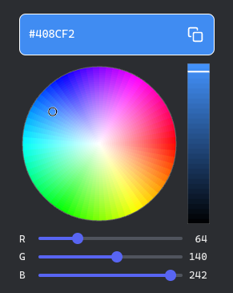

# iced_color_picker

An [Iced](https://iced.rs/) color picker: HSV hue/saturation disc, value bar, RGB sliders, hex field, and copy control.



**Iced 0.14** with the `canvas`, `svg`, and `advanced` features (enable the same features on `iced` in your app).

## Features

- Circular **hue / saturation** disc and vertical **value** bar  
- **R**, **G**, **B** sliders and **#RRGGBB** input  
- **Copy** button (your app handles `PickerMessage::CopyHex` and writes the clipboard—see `examples/demo.rs`)  

No preset palette or swatch grid; only the picker UI and `ColorPickerState`.

## Example

```bash
cargo run --example demo
```